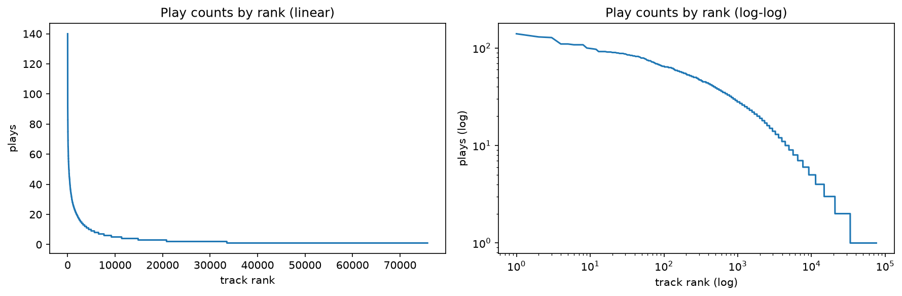

# alys


Learning about my Spotify preferences from Spotify data. Can I do a better job than Spotify itself?



## quickstart

```bash
source ~/virtualenvs/alys/bin/activate
make install-dev          # editable install + dev/notebook/mf extras
cp .env.example .env      # add your Last.fm API key
make test lint            # everything should be green
```

See [`doc/PROJECT_PLAN.md`](doc/PROJECT_PLAN.md) for the full roadmap. Approach:
behavioral-only features + Last.fm genre tags → session detection → content-based
& matrix-factorization recommenders → compare against what Spotify actually served.

## what's with the name?

Named after [Alys Rivers](https://gameofthrones.fandom.com/wiki/Alys_Rivers) for no particular reason. 


